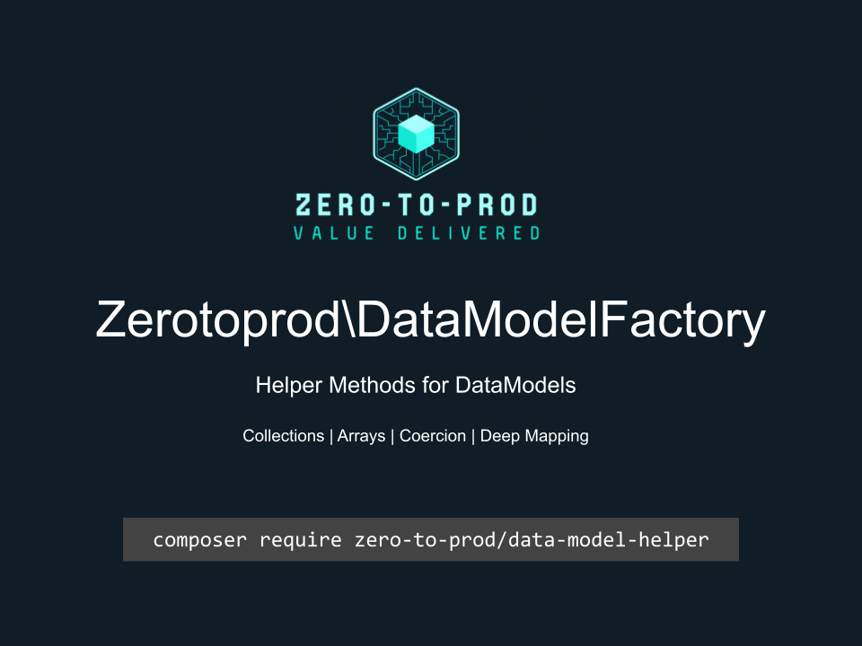

# Zerotoprod\DataModelHelper



[](https://github.com/zero-to-prod/data-model-helper)
[](https://github.com/zero-to-prod/data-model-helper/actions)
[](https://packagist.org/packages/zero-to-prod/data-model-helper/stats)
[](https://packagist.org/packages/zero-to-prod/data-model-helper/stats)
[](https://packagist.org/packages/zero-to-prod/data-model-helper)
[](https://github.com/zero-to-prod/data-model-helper/blob/main/LICENSE.md)

Utilities for casting values using the [DataModel](https://github.com/zero-to-prod/data-model) package.

## Installation

Install the package via Composer:

```bash
composer require zero-to-prod/data-model-helper
```

## Usage

### Including the Trait

Include the `DataModelHelper` trait in your class to access helper methods:

```php
class DataModelHelper
{
    use \Zerotoprod\DataModelHelper\DataModelHelper;
}
```

## Helper Methods

- [mapOf](#mapof): Create a map of any type by using
- [pregReplace](#pregreplace): Perform a regular expression search and replace.
- [isUrl](#isurl): Validates a url.

### `mapOf`

Create a map of any type by using the `DataModelHelper::mapOf()` method.

```php
use Zerotoprod\DataModel\Describe;

class User
{
    use \Zerotoprod\DataModel\DataModel;
    use \Zerotoprod\DataModelHelper\DataModelHelper;
    
    /** @var Collection<int, Alias> $Aliases */
    #[Describe([
        'cast'    => [self::class, 'mapOf'],    // Casting method to use
        'type'    => Alias::class,              // Target type for each item
        'coerce'  => true,                      // Coerce single elements into an array
        'using'   => [self::class, 'map'],      // Custom mapping function
        'map_via' => 'mapper',                  // Custom mapping method (defaults to 'map')
        'map' => [self::class, 'keyBy'],        // Run a function for that value.
        'level' => 1,                           // The dimension of the array. Defaults to 1.
        'key_by' => 'key',                      // Key an associative array by a field.
    ])]
    public Collection $Aliases;
}
```

#### Usage

In this case the `mapOf()` method returns an array of `Alias` instances.

```php
use Zerotoprod\DataModel\Describe;

class User
{
    use \Zerotoprod\DataModel\DataModel;
    use \Zerotoprod\DataModelHelper\DataModelHelper;
    
    /** @var Alias[] $Aliases */
    #[Describe([
        'cast' => [self::class, 'mapOf'],   // Use the mapOf helper method
        'type' => Alias::class,             // Target type for each item
    ])]
    public array $Aliases;
}

class Alias
{
    use \Zerotoprod\DataModel\DataModel;
    
    public string $name;
}

$User = User::from([
    'Aliases' => [
        ['name' => 'John Doe'],
        ['name' => 'John Smith'],
    ]
]);

echo $User->Aliases[0]->name; // Outputs: John Doe
echo $User->Aliases[1]->name; // Outputs: John Smith
```

#### Laravel Collection Example

The `mapOf` helper is designed to work will with the `\Illuminate\Support\Collection` class.

```php
use Zerotoprod\DataModel\Describe;

class User
{
    use \Zerotoprod\DataModel\DataModel;
    use \Zerotoprod\DataModelHelper\DataModelHelper;
    
    /** @var Collection<int, Alias> $Aliases */
    #[Describe([
        'cast' => [self::class, 'mapOf'],
        'type' => Alias::class,
    ])]
    public \Illuminate\Support\Collection $Aliases;
}

class Alias
{
    use \Zerotoprod\DataModel\DataModel;
    
    public string $name;
}

$User = User::from([
    'Aliases' => [
        ['name' => 'John Doe'],
        ['name' => 'John Smith'],
    ]
]);

echo $User->Aliases->first()->name; // Outputs: John Doe
```

#### Coercing

Sometimes, an attribute may contain either a single element or an array of elements. By setting `'coerce' => true`, you can ensure that single
elements
are coerced into an array.

```php
use Zerotoprod\DataModel\Describe;

class User
{
    use \Zerotoprod\DataModel\DataModel;
    use \Zerotoprod\DataModelHelper\DataModelHelper;
    
    /** @var Alias[] $Aliases */
    #[Describe([
        'cast'   => [self::class, 'mapOf'],
        'type'   => Alias::class,
        'coerce' => true, // Coerce single elements into an array
    ])]
    public array $Aliases;
}

class Alias
{
    use \Zerotoprod\DataModel\DataModel;
    
    public string $name;
}

$User = User::from([
    'Aliases' => ['name' => 'John Doe'], // Single element instead of an array
]);

echo $User->Aliases[0]->name; // Outputs: John Doe
```

#### Using a Custom Mapping Function

Specify your mapping function by setting the `using` option.

```php
use Zerotoprod\DataModel\Describe;

class User
{
    use \Zerotoprod\DataModel\DataModel;
    use \Zerotoprod\DataModelHelper\DataModelHelper;
    
    /** @var Collection $Aliases */
    #[Describe([
        'cast'  => [self::class, 'mapOf'],
        'type'  => Alias::class,
        'using' => [self::class, 'map'], // Use custom mapping function
    ])]
    public Collection $Aliases;

    public static function map(array $values): Collection
    {
        // Map each value to an Alias instance
        $items = array_map(fn($value) => Alias::from($value), $values);

        // Return as a Collection
        return new Collection($items);
    }
}

class Alias
{
    use \Zerotoprod\DataModel\DataModel;
    
    public string $name;
}

class Collection
{
    public array $items;

    public function __construct(array $items = [])
    {
        $this->items = $items;
    }
}

$User = User::from([
    'Aliases' => [
        ['name' => 'John Doe'],
    ],
]);

echo $User->Aliases->items[0]->name; // Outputs: John Doe
```

#### Specifying a Custom Mapping Method

By default, the map method is used to map over elements. You can specify a different method using the `map_via` option.

```php
use Zerotoprod\DataModel\Describe;

class User
{
    use \Zerotoprod\DataModel\DataModel;
    use \Zerotoprod\DataModelHelper\DataModelHelper;
    
    /** @var Collection $Aliases */
    #[Describe([
        'cast'    => [self::class, 'mapOf'],
        'type'    => Alias::class,
        'map_via' => 'mapper', // Use custom mapping method for the `Collection` class.
    ])]
    public Collection $Aliases;
}

class Alias
{
    use \Zerotoprod\DataModel\DataModel;

    public string $name;
}

class Collection
{
    public array $items;

    public function __construct(array $values)
    {
        $this->items = $values;
    }

    public function mapper(callable $callable): Collection
    {
        $this->items = array_map($callable, $this->items);
        return $this;
    }
}

$User = User::from([
    'Aliases' => [
        ['name' => 'John Doe'],
    ],
]);

echo $User->Aliases->items[0]->name; // Outputs: John Doe
```

#### Deep Mapping

You can set the level for mapping deep arrays.

```php
use Zerotoprod\DataModel\Describe;

class User
{
    use \Zerotoprod\DataModel\DataModel;
    use \Zerotoprod\DataModelHelper\DataModelHelper;
    
    /** @var Alias[] $Aliases */
    #[Describe([
        'cast' => [self::class, 'mapOf'],   // Use the mapOf helper method
        'type' => Alias::class,             // Target type for each item
        'level' => 2,                       // The dimension of the array. Defaults to 1.
    ])]
    public array $Aliases;
}

class Alias
{
    use \Zerotoprod\DataModel\DataModel;
    
    public string $name;
}

$User = User::from([
    'Aliases' => [
        [
            ['name' => 'John Doe'],
            ['name' => 'John Smith'],
        ]
    ]
]);

echo $User->Aliases[0][0]->name; // Outputs: John Doe
echo $User->Aliases[0][1]->name; // Outputs: John Smith
```

#### KeyBy
Key an array by an element value by using the `key_by` argument.

This also supports deep mapping.

Note: this only applies to arrays.
```php
class User
{
    use \Zerotoprod\DataModel\DataModel;
    use \Zerotoprod\DataModelHelper\DataModelHelper;
    
    /** @var Alias[] $Aliases */
    #[Describe([
        'cast' => [self::class, 'mapOf'],   
        'type' => Alias::class,             
        'key_by' => 'id',
    ])]
    public array $Aliases;
}

class Alias
{
    use \Zerotoprod\DataModel\DataModel;
    
    public string $id;
    public string $name;
}

$User = User::from([
    'Aliases' => [
        [
            'id' => 'jd1',
            'name' => 'John Doe',
        ],
        [
            'id' => 'js1',
            'name' => 'John Smith'
        ],
    ]
]);

echo $User->Aliases['jd1']->name;  // 'John Doe'
echo $User->Aliases['js1']->name); // 'John Smith'
```

#### Map
Call a function for that value.

Note: This does not work with arrays.
```php
class User
{
    use \Zerotoprod\DataModel\DataModel;
    use \Zerotoprod\DataModelHelper\DataModelHelper;
    
    /** @var Alias[] $Aliases */
    #[Describe([
        'cast' => [self::class, 'mapOf'],   
        'type' => Alias::class,             
        'map' => [self::class, 'keyBy'],
    ])]
    public Collection $Aliases;
    
    public static function keyBy(Collection $values): Collection
    {
        return $values->keyBy('id');
    }
}

class Alias
{
    use \Zerotoprod\DataModel\DataModel;
    
    public string $id;
    public string $name;
}

$User = User::from([
    'Aliases' => [
        [
            'id' => 'jd1',
            'name' => 'John Doe',
        ]
    ]
]);

echo $User->Aliases->get('jd1')->name;  // 'John Doe'
```

### `pregReplace`

Use `pregReplace` to perform a regular expression search and replace.

```php
class User
{
    use \Zerotoprod\DataModel\DataModel;
    use \Zerotoprod\DataModelHelper\DataModelHelper;
    
    public const ascii_only = '/[^\x00-\x7F]/';

    #[Describe([
        'cast' => [self::class, 'pregReplace'],
        'pattern' => ascii_only,
        'replacement' => '!' // defaults to '' when not specified
    ])]
    public string $name;
}

$User = User::from([
    'name' => 'Trophy🏆',
]);

echo $User->name; // Outputs: 'Trophy!'
```

### `isUrl`

Use `isUrl` to perform validate a url.

```php
class User
{
    use \Zerotoprod\DataModel\DataModel;
    use \Zerotoprod\DataModelHelper\DataModelHelper;

    #[Describe([
        'cast' => [self::class, 'isUrl'],
        'protocols' => ['http', 'udp'], // Optional. Defaults to all.
        'on_fail' => [MyAction::class, 'method'], // Optional. Invoked when validation fails.
        'exception' => InvalidUrlException::class, // Optional. Throws an exception when not url.
        'required'  // Optional. Throws \Zerotoprod\DataModel\PropertyRequiredException::class
    ])]
    public string $url;
}
```